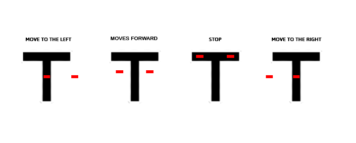

[Spanish](https://github.com/vegamc04/line_follower_robot_with_ai_vision/blob/master/readme_config/versions/readme_es.md)

[Portuguese](https://github.com/vegamc04/line_follower_robot_with_ai_vision/blob/master/readme_config/versions/readme_pt.md)

# Line follower robot with AI vision

Project developed with [Esp32](https://www.espressif.com/), [Arduino](https://www.arduino.cc/) and [Python](https://www.python.org/)

## Components used (Traffic Lights)

- Arduino UNO R3
- Protoboard (any size preference)
- YXC005 (led traffic light module) - Quantity: **2**
- 220 Ω resistors - Quantity: **6**
- Male-male dupont wires - Quantity: **8**
- USB A to USB B cable (for Arduino)

## Components used (Line Follower Robot)

- Esp32 cam OV2640
- Esp32 cam MB (adapter)
- Protoboard (any size preference)
- HG7881CP (h-bridge)
- TCRT5000 (infrared line follower sensor) - Quantity: **2**
- Female-female dupont wire - Quantity:**6**
- Female-male dupont wire - Quantity:**8**
- USB A to micro USB cable (for Esp32)
- 2WD Chassis:

    |Component|Quantity|
    |:--------|:--------|
    |Chassis support base|1|
    |Plastic tires|2|
    |TT gearmotors|2|
    |Caster wheel|1|
    |4x Battery holder|3|
    |Switch|2|
    **Note:** Includes support pieces, nuts, and screws for assembly.

## Initialization instructions

1. Install the "Arduino AVR Boards" library from Arduino and the "esp32" library from Espressif Systems in your preferred development environment (Arduino IDE is recommended) through the Boards Manager.

2. Navigate to the [arduino.ino](./arduino/arduino.ino) file and connect your Arduino Uno to your computer using the usb cable, upload the code to it, and then reset it.

3. Navigate to the [esp32.ino](./esp32/esp32.ino) file and set your credentials, that is, assign values to the ssid and password variables.

4. Connect your Esp32 to your computer using the usb cable so you can upload the code to it, and then reset it for the changes to take effect.

5. Check the serial monitor in your development environment, you will find the assigned IP address there.

**Important: To continue, you need to have Python 3.13.2 or a higher version installed.**

6. Install the "virtualenv" library through a terminal using the command `pip install virtualenv`

7. Navigate to the "python" folder and create a virtual environment using the command `virtualenv venv`

8. Activate the virtual environment using the command `.\venv\Scripts\activate` and install the requirements file using the command `pip install -r requirements.txt`

9. Select the interpreter "Python 3.13.2 (venv)". The process varies depending on the code editor you are using (Visual Studio Code is recommended).

10. Navigate to the [esp32.py](./python/esp32.py) file and set your credentials, that is, assign a value to the url variable in the format `"http://your-ip-address"`

11. Run your Python code.

## Operation

|Component|Detection|Action|
|:--------|:--------|:--------|
|TCRT5000|White background|Moves forward|
|TCRT5000|Black background|Stop|
|Camera|Green traffic light|Moves forward|
|Camera|Red traffic light|Stop|

General connection diagram (traffic lights), complete project in [Tinkercad](https://www.tinkercad.com/things/gRG2Fpa8bdf-traffic-lights)

General connection diagram (line follower robot), complete project in [Tinkercad](https://www.tinkercad.com/things/cGooTZW4BMB-line-follower-robot)

## Photographs

Shield: [![CC BY-SA 4.0][cc-by-sa-shield]][cc-by-sa]

This work is licensed under a
[Creative Commons Attribution-ShareAlike 4.0 International License][cc-by-sa].

[![CC BY-SA 4.0][cc-by-sa-image]][cc-by-sa]

[cc-by-sa]: http://creativecommons.org/licenses/by-sa/4.0/
[cc-by-sa-image]: https://licensebuttons.net/l/by-sa/4.0/88x31.png
[cc-by-sa-shield]: https://img.shields.io/badge/License-CC%20BY--SA%204.0-lightgrey.svg
