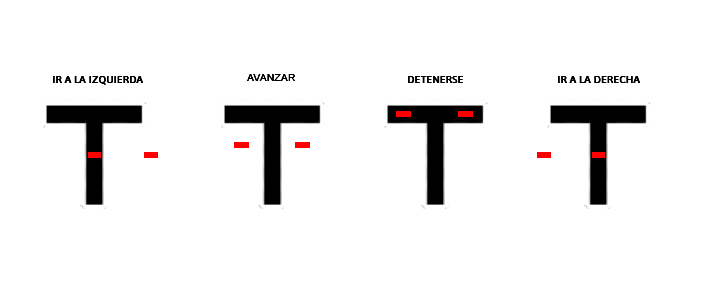
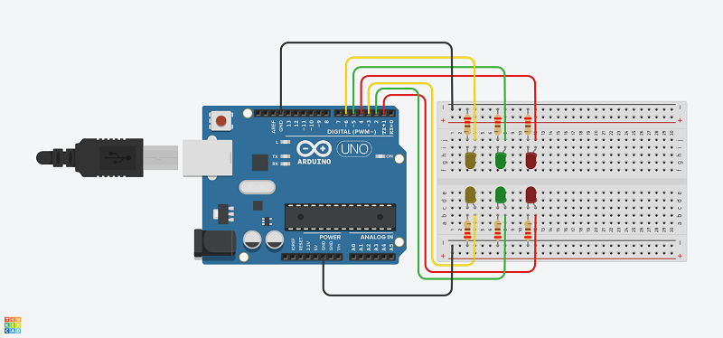
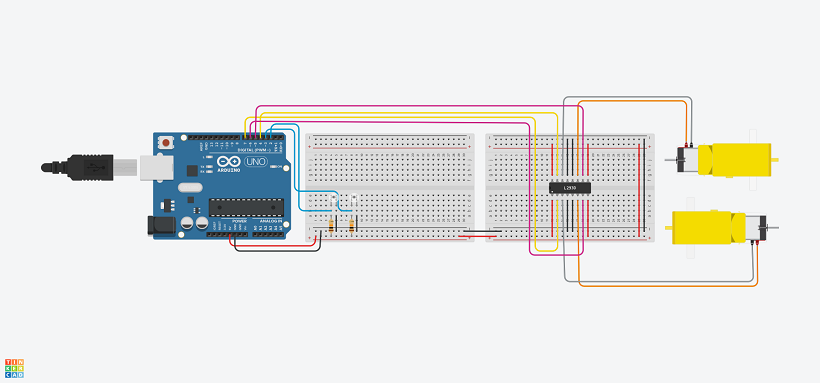
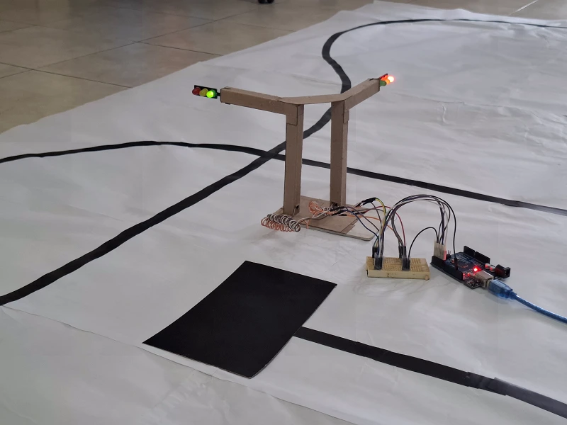
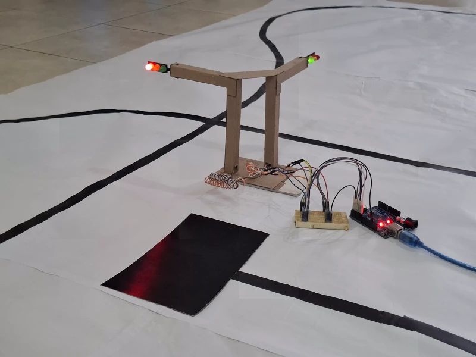
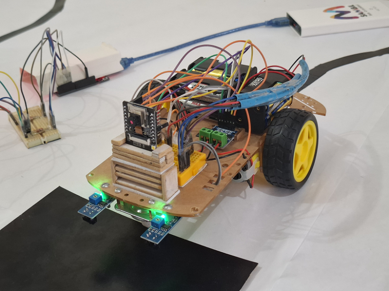
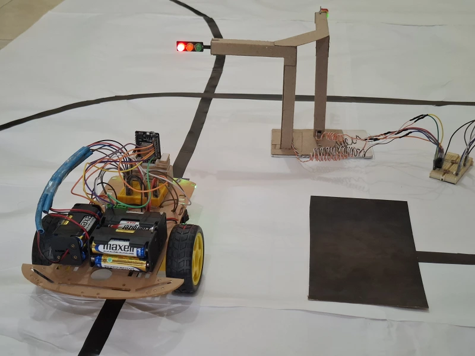

[Ingles](https://github.com/vegamc04/line_follower_robot_with_ai_vision/blob/master/README.md)

[Portugues](https://github.com/vegamc04/line_follower_robot_with_ai_vision/blob/master/readme_config/versions/readme_pt.md)

# Robot seguidor de linea con vision artificial

Proyecto desarrollado con [Esp32](https://www.espressif.com/), [Arduino](https://www.arduino.cc/) y [Python](https://www.python.org/)

## Componentes utilizados (Semaforos)

- Arduino UNO R3
- Placa de pruebas (tamaño de preferencia)
- YXC005 (modulo de semaforo led) - Cantidad: **2**
- Resistores de 220 Ω - Cantidad: **6**
- Cables dupont macho-macho - Cantidad: **8**
- Cable de USB A a USB B (para Arduino)

## Componentes utilizados (Robot seguidor de linea)

- Esp32 cam OV2640
- Esp32 cam MB (adaptador)
- Placa de pruebas (tamaño de preferencia)
- HG7881CP (puente h)
- TCRT5000 (sensor infrarrojo seguidor de linea) - Cantidad: **2**
- Cable dupont hembra-hembra - Cantidad: **6**
- Cable dupont hembra-macho - Cantidad: **8**
- Cable de USB A a micro USB (para Esp32)
- Chasis 2WD:

    |Componente|Cantidad|
    |:--------|:--------|
    |Base de soporte del chasis|1|
    |Llantas plásticas|2|
    |Motorreductores TT|2|
    |Rueda loca|1|
    |Portapilas 4x|3|
    |Interruptor|2|
    **Nota:** Incluye piezas de soporte, tuercas y tornillos para el ensamblaje.

## Instrucciones de inicializacion

1. Instala la libreria "Arduino AVR Boards" de Arduino y la libreria "esp32" de Espressif Systems en tu entorno de desarrollo preferido (se recomienda Arduino IDE) a traves del Administrador de Placas.

2. Navega al archivo [arduino.ino](../../arduino/arduino.ino) y conecta tu Arduino Uno a tu computadora usando el cable usb, sube el codigo y luego resetealo.

3. Navega al archivo [esp32.ino](../../esp32/esp32.ino) y establece tus credenciales, es decir, asigna valores a las variables ssid y password.

4. Conecta tu Esp32 a tu computadora usando el cable usb para poder subir el codigo, luego resetea la placa para que los cambios surtan efecto.

5. Verifica el monitor serial en tu entorno de desarrollo, alli encontraras la dirección IP asignada.

**Importante: Para continuar, necesitas tener Python 3.13.2 o una version superior instalada.**

6. Instala la libreria "virtualenv" a traves de una terminal usando el comando `pip install virtualenv`

7. Navega a la carpeta "python" y crea un entorno virtual usando el comando `virtualenv venv`

8. Activa el entorno virtual usando el comando `.\venv\Scripts\activate` e instala el archivo de requerimientos usando el comando `pip install -r requirements.txt`

9. Selecciona el interprete "Python 3.13.2 (venv)". El proceso varia dependiendo del editor de codigo que estes utilizando (se recomienda Visual Studio Code).

10. Navega al archivo [esp32.py](../../python/esp32.py) y establece tus credenciales, es decir, asigna un valor a la variable url en el formato `"http://tu-direccion-ip"`

11. Ejecuta tu codigo Python.

## Funcionamiento

|Componente|Deteccion|Accion|
|:--------|:--------|:--------|
|TCRT5000|Fondo blanco|Avanzar|
|TCRT5000|Fondo negro|Detenerse|
|Camara|Luz verde|Avanzar|
|Camara|Luz roja|Detenerse|

Diagrama de conexion general (semaforos), proyecto completo en [Tinkercad](https://www.tinkercad.com/things/gRG2Fpa8bdf-traffic-lights)

Diagrama de conexion general (robot seguidor de linea), proyecto completo en [Tinkercad](https://www.tinkercad.com/things/cGooTZW4BMB-line-follower-robot)

## Fotografias

Shield: [![CC BY-SA 4.0][cc-by-sa-shield]][cc-by-sa]

This work is licensed under a
[Creative Commons Attribution-ShareAlike 4.0 International License][cc-by-sa].

[![CC BY-SA 4.0][cc-by-sa-image]][cc-by-sa]

[cc-by-sa]: http://creativecommons.org/licenses/by-sa/4.0/
[cc-by-sa-image]: https://licensebuttons.net/l/by-sa/4.0/88x31.png
[cc-by-sa-shield]: https://img.shields.io/badge/License-CC%20BY--SA%204.0-lightgrey.svg
