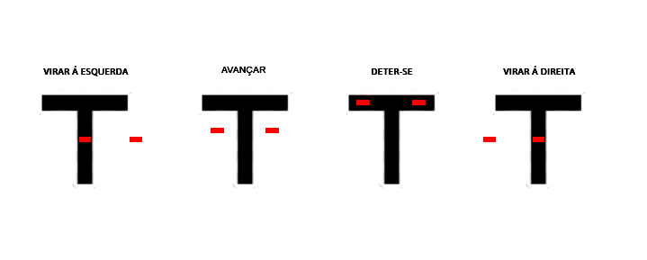

[Inglês](https://github.com/vegamc04/line_follower_robot_with_ai_vision/blob/master/README.md)

[Espanhol](https://github.com/vegamc04/line_follower_robot_with_ai_vision/blob/master/readme_config/versions/readme_es.md)

# Robô seguidor de linha com visão artificial

Projeto desenvolvido com [Esp32](https://www.espressif.com/), [Arduino](https://www.arduino.cc/) e [Python](https://www.python.org/)

## Componentes utilizados (Semáforos)

- Arduino UNO R3
- Placa de ensaio (tamanho de preferência)
- YXC005 (módulo de semáforo led) - Quantidade: **2**
- Resistores de 220 Ω - Quantidade: **6**
- Cabos dupont macho-macho - Quantidade: **8**
- Cabo de USB A para USB B (para Arduino)

## Componentes utilizados (Robô seguidor de linha)

- Esp32 cam OV2640
- Esp32 cam MB (adaptador)
- Placa de pruebas (tamanho de preferência)
- HG7881CP (ponte h)
- TCRT5000 (sensor infravermelho seguidor de linha) - Quantidade: **2**
- Cabos dupont fêmea-fêmea - Quantidade: **6**
- Cabos dupont fêmea-macho - Quantidade: **8**
- Cabo de USB A para micro USB (para Esp32)
- Chassi 2WD:

    |Componente|Quantidade|
    |:--------|:--------|
    |Base de suporte do chassi|1|
    |Rodas plásticas|2|
    |Motorreductores TT|2|
    |Roda livre|1|
    |Porta pilhas 4x|3|
    |Interruptor|2|
    **Nota:** Inclui peças de suporte, porcas e parafusos para a montagem.

## Instruções de Inicialização

1. Navegue até o arquivo [arduino.ino](../../arduino/arduino.ino) e conecte seu Arduino Uno ao seu computador usando o cabo USB, carregue o código e depois reinicie-o.

2. Instale a biblioteca "Arduino AVR Boards" do Arduino e a biblioteca "esp32" da Espressif Systems no seu ambiente de desenvolvimento preferido (recomenda-se Arduino IDE) através do Gerenciador de Placas.

3. Navegue até o arquivo [esp32.ino](../../esp32/esp32.ino) e defina suas credenciais, ou seja, atribua valores às variáveis ssid e password.

4. Conecte seu ESP32 ao seu computador usando o cabo USB para poder carregar o código, depois reinicie a placa para que as alterações tenham efeito.

5. Verifique o monitor serial no seu ambiente de desenvolvimento, ali você encontrará o endereço IP atribuído.

**Importante: Para continuar, você precisa ter o Python 3.13.2 ou uma versão superior instalada.**

6. Instale a biblioteca "virtualenv" através de um terminal usando o comando `pip install virtualenv`

7. Navegue até a pasta "python" e crie um ambiente virtual usando o comando `virtualenv venv`

8. Ative o ambiente virtual usando o comando `.\venv\Scripts\activate` e instale o arquivo de requerimentos usando o comando `pip install -r requirements.txt`

9. Selecione o interpretador "Python 3.13.2 (venv)". O processo varia dependendo do editor de código que você está utilizando (recomenda-se Visual Studio Code).

10. Navegue até o arquivo [esp32.py](../../python/esp32.py) e defina suas credenciais, ou seja, atribua um valor à variável url no formato `"http://seu-endereco-ip"`

11. Execute seu código Python.

## Funcionamento

|Componente|Detecção|Ação|
|:--------|:--------|:--------|
|TCRT5000|Fundo branco|Avançar|
|TCRT5000|Fundo preto|Deter-se|
|Câmera|Luz verde|Avançar|
|Câmera|Luz vermelha|Deter-se|

Diagrama de conexão geral (semáforos), projeto completo em [Tinkercad](https://www.tinkercad.com/things/gRG2Fpa8bdf-traffic-lights)

Diagrama de conexão geral (robô seguidor de linha), projeto completo em [Tinkercad](https://www.tinkercad.com/things/cGooTZW4BMB-line-follower-robot)

## Fotografias

Shield: [![CC BY-SA 4.0][cc-by-sa-shield]][cc-by-sa]

This work is licensed under a
[Creative Commons Attribution-ShareAlike 4.0 International License][cc-by-sa].

[![CC BY-SA 4.0][cc-by-sa-image]][cc-by-sa]

[cc-by-sa]: http://creativecommons.org/licenses/by-sa/4.0/
[cc-by-sa-image]: https://licensebuttons.net/l/by-sa/4.0/88x31.png
[cc-by-sa-shield]: https://img.shields.io/badge/License-CC%20BY--SA%204.0-lightgrey.svg
